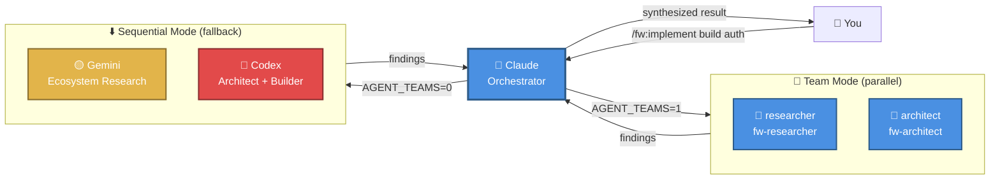
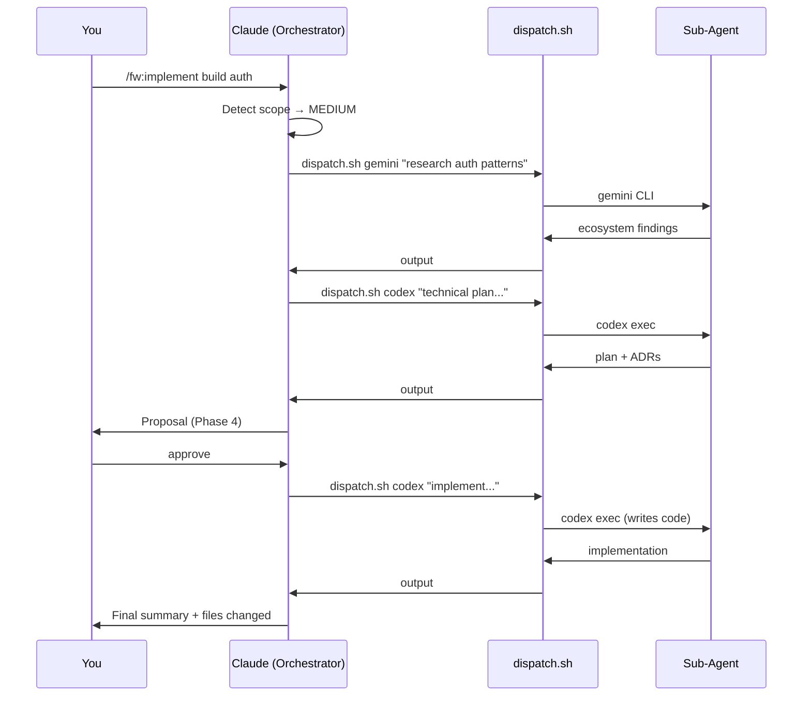

# Flywheel Plugin for Claude Code

> **Multi-provider AI orchestration plugin** — Let Claude orchestrate specialized agents (Codex, Gemini, Claude teammates) across structured workflows

[](https://github.com/yourusername/flywheel-plugin)
[](LICENSE)

---

## What is Flywheel?

Flywheel transforms Claude into an **orchestrator** that spawns specialized AI agents for different tasks. Instead of Claude doing everything alone, it delegates specific work to expert agents and synthesizes their outputs.

**Think of it as:** Claude is the project manager, sub-agents are the specialists.



---

## 🚀 Setup

```bash

# 1. Add this repository as a plugin marketplace
claude plugin marketplace add gmedali/flywheel-plugin

# 2. Install the plugin
claude plugin install fw
```

once you run claude, please run:

```bash
/fw:setup
```

`/fw:setup` will detect your providers, install personas, and optionally configure **agent teams** for parallel workflows. All `/fw:` commands are ready to use immediately.

---

## 🎭 Personas

Flywheel ships 10 **native Claude Code sub-agents** — persistent specialists that each `/fw:` command activates. They run in isolated context windows with curated tool access and model routing, replacing ad-hoc prompt strings with real behavioural mandates.

| Persona | Model | Used by | Role |
|---------|-------|---------|------|
| `fw-architect` | opus | `/fw:design`, `/fw:implement` | Commits to one approach, produces ADRs, file impact maps, risk registers |
| `fw-researcher` | sonnet | Research phases | Filters external knowledge through your existing stack, rates every option |
| `fw-debugger` | sonnet | `/fw:debug` | Forensic root-cause analysis — mandatory causal chain, no guesses |
| `fw-security-auditor` | opus | `/fw:harden` | Offensive OWASP scanner — every finding has attack scenario + patch |
| `fw-code-reviewer` | sonnet | `/fw:review` | Blocking vs advisory classification — every finding has file:line + fix |
| `fw-tdd-specialist` | sonnet | `/fw:tdd` | Red→Green→Refactor enforcer — refuses implementation without failing test |
| `fw-test-generator` | sonnet | `/fw:test` | P0→P3 risk-prioritised coverage — learns your conventions before writing |
| `fw-migration-engineer` | sonnet | `/fw:migrate` | Batched migrations with mandatory rollback plans and validation gates |
| `fw-fe-designer` | sonnet | `/fw:fe-design` | Distinctive, production-grade frontend interfaces — zero generic AI aesthetics |
| `fw-reflector` | sonnet | `/fw:reflect` | Multi-dimensional quality synthesis — balances strengths with concerns, severity-sorted narrative reports |

**Installation:** `/fw:setup` runs `scripts/install-personas.sh` to copy all personas to `~/.claude/agents/`. Upgrade anytime:
```bash
"${CLAUDE_PLUGIN_ROOT}/scripts/install-personas.sh" --force
```

---

## 🤝 Agent Teams (v1.1.0)

Flywheel v1.1.0 adds **native Claude-to-Claude parallel execution** via the `CLAUDE_CODE_EXPERIMENTAL_AGENT_TEAMS` feature flag. When enabled, complex commands spawn specialist teammates that work in parallel instead of sequentially.

**Commands that gain parallel teammates:**

| Command | Template | Parallel Phases | Teammates |
|---------|----------|-----------------|-----------|
| `/fw:implement` | `research-and-plan` | 1a+1b, 7+8 | researcher, architect, test-writer |
| `/fw:design` | `research-and-plan` | 1+2 | researcher, architect |
| `/fw:review` | `parallel-review` | All analysis (critical level) | security, quality, test reviewers |
| `/fw:reflect` | `parallel-analysis` | Phase 2 aspects | 1 per aspect (up to 4) |
| `/fw:harden` | `parallel-scan` | Phase 1 scans | owasp, dependency, secrets scanners |
| `/fw:migrate` | `parallel-migration-research` | Phase 1b | framework-researcher, codebase-analyzer |

**Enabling:** Run `/fw:setup` and select "yes" for agent teams, or set manually:
```bash
# In ~/.claude/settings.json
{ "env": { "CLAUDE_CODE_EXPERIMENTAL_AGENT_TEAMS": "1" } }
```

**Fallback:** All commands work identically without the feature flag — sequential mode is the default. No behavior changes unless you opt in.

**Cost:** Each teammate is a separate Claude instance. Teams cost ~2–4x more tokens. Use `FLYWHEEL_DISABLE_TEAMS=1` to temporarily disable without removing the flag.

> See [`agents/team-roles/README.md`](./agents/team-roles/README.md) for the full team orchestration pattern.

---

## 📚 Commands

### `/fw:fe-design <description>`

**Build production-grade frontend interfaces with a committed aesthetic direction.** Unlike `/fw:design`, this command produces **working, runnable code** directly. Activates `fw-fe-designer`.

```
/fw:fe-design a dashboard for real-time analytics
/fw:fe-design a luxury login page for a fintech app
/fw:fe-design a component library card in React
```

**Phases:**

| # | Phase | What happens |
|---|-------|--------------|
| 0 | Parse & Clarify | Brief, tech stack, up to 3 follow-up questions |
| 1 | Aesthetic Direction | Commits to a named visual approach, typography, palette, signature element |
| 2 | Build | Complete, runnable code — HTML/CSS/JS, React, or Vue |
| 3 | Present | Design direction · Rationale · Code · Usage |
| 4 | Iterate / Hand Off | `refine` / `variant` / `review` / `implement` / `done` |

**Non-negotiables:** No generic fonts (Inter, Roboto, Arial). No purple-gradients-on-white. CSS variables everywhere. At least one purposeful animation. Depth on every background.

**Output:** Complete, runnable code saved to `~/.flywheel/projects/<project>/fe-design/<session>/`.

---

### `/fw:design <description>`

**Research-driven design workflow.** Analyses requirements, scans the codebase, researches best practices, and produces a detailed plan-of-action document (`DESIGN-PLAN.md`) in the project root. **Never modifies code.**

```
/fw:design add real-time notifications with WebSocket support
/fw:design migrate our monolith to a modular plugin architecture
/fw:design implement role-based access control
```

**Phases:**

| # | Phase | Agent | What happens |
|---|-------|-------|-------------|
| 0 | Parse & Classify | Claude | Understands requirements, classifies `light` / `standard` / `deep` |
| 1 | Codebase Analysis | Claude | Scans relevant files, maps patterns, identifies constraints |
| 2 | Ecosystem Research | Gemini / `researcher` teammate | Best practices, packages, pitfalls, security considerations |
| 3 | Deep Analysis | Codex / `architect` teammate | Evaluates approaches, recommends architecture, identifies risks |
| 4 | Resolve Questions | Claude | Surfaces blocking decisions for the user (max 5) |
| 5 | Write Plan | Claude | Produces `DESIGN-PLAN.md` with full task breakdown |
| 6 | **User Gate** | **You** | `approve` / `refine` / `deeper` / `implement` |

> **Team mode** (`standard`/`deep`): Phases 1 and 2 run in parallel — lead scans codebase while `researcher` teammate researches ecosystem. Phase 3 uses `architect` teammate.

**Output:** A structured plan covering requirements, solution overview, files impacted, ordered task breakdown with validation steps, risks, and a testing strategy.

**Complexity behaviour:**
- `light` (config/rename/simple addition) — skips ecosystem research + deep analysis
- `standard` (new feature/integration) — full workflow
- `deep` (architecture/migration/system redesign) — full workflow + expanded research

---

### `/fw:implement <feature description>`

**Full 9-phase feature workflow.** The most powerful command — handles everything from research to tested code.

```
/fw:implement build a user authentication system with JWT
/fw:implement add a logout button to the nav
/fw:implement architect a multi-tenant permission system
```

**Phases:**

| # | Phase | Agent | What happens |
|---|-------|-------|-------------|
| 0 | Scope detection | Claude | Detects `small` / `medium` / `large` |
| 1a | Codebase Research | Claude | Scans existing code, patterns, constraints |
| 1b | Ecosystem Research | Gemini / `researcher` teammate | Best practices, libraries, pitfalls |
| 2 | Planning | `fw-architect` / `architect` teammate | Approach comparison, ADRs, file map, risk register |
| 3 | Questions | Claude | Gap analysis, max 5 critical questions |
| 4 | Proposal | Claude | Structured spec + acceptance criteria |
| 5 | **User Gate** | **You** | ⛔ Approve / modify / cancel |
| 6 | Iteration | Codex + Claude | Approach review loop (medium/large) |
| 7 | Implementation | Codex | Writes the code |
| 8 | Testing | Codex / `test-writer` teammate | TDD-style tests + coverage review |
| 9 | Return | Claude | Summary, files changed, next steps |

**Scope behaviour:**
- `small` (fix/add/tweak) — skips ecosystem research + iteration loop + teams
- `medium` (implement/build) — full workflow
- `large` (architect/system) — full workflow + deeper research

> **Team mode** (`medium`/`large`): Phases 1a+1b run in parallel; Phase 2 uses `architect` teammate; Phase 8 uses `test-writer` teammate while Phase 7 implementation runs.

---

### `/fw:debug <issue description>`

**6-phase diagnostic workflow.** Identifies root causes and proposes solutions — **never modifies code.**

```
/fw:debug TypeError: Cannot read property 'map' of undefined in UserList
/fw:debug requests are taking 10 seconds before the first API call
/fw:debug login redirects to a blank page after OAuth callback
```

**Phases:**

| # | Phase | Agent | What happens |
|---|-------|-------|-------------|
| 0 | Parse & Classify | Claude | Detects `low` / `medium` / `critical` severity |
| 1 | Reproduce & Observe | Claude | Locates failing code, traces data flow, checks git history |
| 2 | Deep Analysis | `fw-debugger` | Causal chain, hypotheses eliminated, minimal fix proposed |
| 3 | Cross-Reference | Gemini | Checks for known bugs, documented gotchas |
| 4 | Diagnosis Report | Claude | Root cause, failing code, explanation, proposed solution |
| 5 | **User Gate** | **You** | `accept` / `deeper` / `delegate` fix |

**Severity behaviour:**
- `low` (config/lint/warning) — skips Gemini cross-reference
- `medium` (runtime error/regression) — full workflow
- `critical` (crash/data loss/security) — full workflow + deeper analysis

**Impact depth** on every proposed solution: `surface` · `local` · `module` · `system`

---

### `/fw:document <topic>`

**5-phase documentation workflow.** Researches the codebase, cross-references ecosystem context, and produces a polished standalone markdown document with mermaid diagrams. **Never modifies code.**

```
/fw:document how does the authorizer work?
/fw:document the request lifecycle from ingress to response
/fw:document dispatch.sh — what it does and how to use it
```

**Phases:**

| # | Phase | Agent | What happens |
|---|-------|-------|-------------|
| 0 | Parse & Classify | Claude | Classifies `narrow` / `broad` / `architectural` scope |
| 1 | Codebase Deep Scan | Claude | Greps, reads, traces call chains, maps component relationships |
| 2 | Ecosystem Cross-Reference | `fw-researcher` / Gemini | Patterns, conventions, gotchas (broad/arch only) |
| 3 | Synthesize Document | Claude | Writes markdown with mermaid diagrams, saves to project |
| 4 | **User Gate** | **You** | `approve` / `refine` / `deeper` / `discard` |

**Scope behaviour:**
- `narrow` (single function/config/endpoint) — skips ecosystem research, codebase alone is sufficient
- `broad` (feature/module/workflow) — full workflow
- `architectural` (system design/data flow/cross-service) — full workflow + expanded research + additional diagram types

**Output:** A markdown document saved to `docs/<topic>.md` or `claudedocs/<topic>.md` in your project, with an overview, ELI5 summary, detailed walkthrough, mermaid diagrams (flowcharts, sequence diagrams, class diagrams — only the types relevant to the topic), key files table, and related topics.

---

### `/fw:summarize [source] [length] [visualize]`

**Plain-English summary of a proposed solution or actual changes.** Translates dense reports, design docs, diffs, or commits into clear, jargon-free explanations a non-expert can follow. Optionally enriched with mermaid diagrams via the `visualize` skill. **Never modifies code.**

```
/fw:summarize                          # auto-detect: latest session report or staged diff
/fw:summarize staged                   # what's about to be committed
/fw:summarize branch                   # the whole current branch in plain language
/fw:summarize last design              # latest /fw:design proposal in simpler terms
/fw:summarize commit HEAD~2            # explain a specific commit
/fw:summarize claudedocs/auth.md       # summarize any markdown report
/fw:summarize staged tiny              # force a 2-3 sentence summary
/fw:summarize last design visualize    # summary + mermaid diagram(s)
/fw:summarize branch no diagrams       # explicitly skip visualization
```

**Sources:** `staged` · `branch` · `last [command]` · `commit <ref>` · `commits <N>` · file path · free text · auto

**Length tiers** (auto-detected from input size, overridable):
- `tiny` — 2-3 sentences
- `short` — 1 paragraph
- `medium` — bullets + paragraph
- `long` — sectioned summary (Plain Terms / What Changed / Why / Watch For)

**Visualization** (auto / forced / skipped): the `visualize` skill self-evaluates structural signals in the source and adds up to 2 diagrams under an `## At a glance` section when they would help. Use `visualize` to force, `no diagrams` to skip.

**User gate:** `accept` / `shorter` / `longer` / `refine` / `audience` / `visualize` (add or replace diagrams).

---

### `/fw:visualize [source] [diagram-type]`

**Generate mermaid diagrams to visualize code, changes, sessions, architectures, or concepts.** Picks the diagram type from content signals (or accepts an override) and produces up to 5 complementary diagrams per output. **Never modifies code.**

```
/fw:visualize                        # auto-detect: latest session or staged diff
/fw:visualize staged                 # diagram of what's about to be committed
/fw:visualize architecture           # project-wide architecture overview
/fw:visualize last design            # visualize a /fw:design proposal
/fw:visualize scripts/dispatch.sh    # call graph of a single file
/fw:visualize commands/ graph        # module dependency graph of a directory
/fw:visualize staged sequence        # force sequence diagram
/fw:visualize how auth flows         # mindmap a free-text concept
```

**Sources:** `staged` · `branch` · `last [command]` · `commit <ref>` · `commits <N>` · file or directory path · `architecture` · free-text concept · auto

**Diagram types** (auto-selected from signals, overridable):
- `flowchart` — processes, decisions, control flow
- `sequence` — actors exchanging messages over time
- `class` — module / class structure
- `state` — lifecycles, status transitions
- `er` — data models, entity relationships
- `graph` — component dependencies
- `mindmap` — concept hierarchies, decompositions
- `timeline` / `gantt` — chronological events, project plans
- `git` — branch / commit / merge history
- `c4` — system architecture across boundaries

**Phases:** Parse → Gather Content → Select Diagram Type(s) → Generate → Render → User Gate (`accept` / `add` / `swap` / `zoom` / `refine` / `export`).

**Output:** Up to 5 mermaid diagrams with framing prose, saved to the session directory and optionally exportable to `docs/<slug>.md` or `claudedocs/<slug>.md`.

**Skill:** `skills/visualize/SKILL.md` — also consumed on-demand by `/fw:summarize`, `/fw:document`, `/fw:design`, `/fw:debug`, `/fw:implement`, and `/fw:reflect`.

---

### `/fw:delegate [using <provider>] <task>`

Delegate a single task to a sub-agent. Best for one-shot tasks.

```
/fw:delegate using codex refactor this function
/fw:delegate research OAuth alternatives
/fw:delegate explain how JWT works
```

**Auto-detection:**

| Task keywords | Provider | Why |
|--------------|----------|-----|
| implement, build, refactor | 🔴 Codex | Code generation strength |
| review, analyze, explain | 🔵 Claude | Reasoning and analysis |
| research, compare, explore | 🟡 Gemini | Broad knowledge |

---

### `/fw:review`

Multi-agent PR code review with configurable depth (`low` / `medium` / `critical`) and output options (`local` / `draft` / `direct` to GitHub).

> **Team mode** (`critical` level only): Spawns three parallel reviewers — `security-reviewer` (fw-security-auditor), `quality-reviewer` (fw-code-reviewer), `test-reviewer` (fw-test-generator) — all working simultaneously on the same PR diff. Lead synthesizes and deduplicates findings before posting.

---

### `/fw:reflect [scope] [aspects]`

**Multi-dimensional quality reflection.** Runs structured analysis across selectable aspects (implementation quality, clean code, design patterns, test coverage) and produces a human-readable narrative report sorted by severity. **Never modifies code.**

```
/fw:reflect staged                          # reflect on staged changes
/fw:reflect src/auth/ implementation clean  # targeted analysis
/fw:reflect branch all                      # full analysis of current branch
/fw:reflect                                 # prompted scope + aspect selection
```

**Phases:**

| # | Phase | Agent | What happens |
|---|-------|-------|-------------|
| 0 | Parse & Configure | Claude | Detects scope (`file` / `module` / `project` / `staged` / `branch`) and aspects |
| 1 | Scope Resolution | Claude | Resolves exact file list, groups by domain, finalises depth (`quick` / `standard` / `deep`) |
| 2 | Analysis | Claude + Codex / `aspect-*` teammates | Per-aspect analysis passes; parallel teammates at `standard`/`deep` depth |
| 3 | Synthesis | `fw-reflector` | Deduplicates findings, sorts by severity, extracts systemic patterns + recommendations |
| 4 | Report | `fw-reflector` | Writes narrative report to `$SESSION_DIR/04-report.md` and displays it in full |
| 5 | **User Gate** | **You** | `accept` / `deeper` / `implement` / `delegate` |

**Selectable aspects:**
1. **Implementation quality** — logic, error handling, async patterns, edge cases
2. **Clean code** — naming, readability, DRY, SOLID, complexity
3. **Design patterns** — architectural alignment, coupling, separation of concerns
4. **Test coverage** — coverage gaps, test quality, brittleness

**Depth behaviour:**
- `quick` (<5 files) — Claude reads and analyzes directly, no sub-agents or teams
- `standard` (5–20 files) — Codex dispatched per aspect (sequential) or one teammate per aspect (team mode)
- `deep` (>20 files) — Codex dispatched per chunk per aspect (sequential) or parallel aspect teammates (team mode)

> **Team mode** (`standard`/`deep`): One `fw-reflector` teammate spawned per selected aspect — all run simultaneously. Up to 4 parallel aspects.

**Output:** Severity-bucketed report (🔴 Critical · 🟠 High · 🟡 Mid · 🟢 Low) with named strengths, systemic patterns, and actionable recommendations. Saved to `~/.flywheel/projects/<project>/reflect/<session>/`.

---

### `/fw:migrate <migration target>`

**6-phase migration workflow.** Handles framework upgrades, dependency bumps, API changes, and language modernization with batch execution and rollback safety.

```
/fw:migrate React 18 → 19
/fw:migrate Express to Fastify
/fw:migrate Jest to Vitest
```

**Phases:**

| # | Phase | Agent | What happens |
|---|-------|-------|-------------|
| 0 | Parse & Scope | Claude | Detects `patch` / `minor` / `major` |
| 1 | Research | Claude + Gemini / `framework-researcher` + `codebase-analyzer` teammates | Codebase inventory + breaking changes research |
| 2 | Manifest | Codex | File-by-file change map, batched by risk |
| 3 | **User Gate** | **You** | ⛔ Approve all / specific batch / modify / cancel |
| 4 | Execute | Codex | Applies changes batch-by-batch with validation |
| 5 | Verify & Report | Claude | Final validation, diff summary, rollback instructions |

**Batch strategy:** Safe (🟢) → Moderate (🟡) → Breaking (🔴), with lint/type/build/test checks between each batch.

> **Team mode** (`minor`/`major`): `framework-researcher` (fw-researcher) and `codebase-analyzer` (fw-migration-engineer) run in parallel — one researches official migration guides while the other inventories the codebase impact.

---

### `/fw:harden [scope]`

**5-phase security audit.** OWASP Top 10 scanning, dependency CVE checks, secrets detection, and auto-generated patches.

```
/fw:harden                          # full project scan
/fw:harden src/auth/                # specific module
/fw:harden #142                     # files changed on PR
```

**Phases:**

| # | Phase | Agent | What happens |
|---|-------|-------|-------------|
| 0 | Parse & Detect | Claude | Scope + stack detection |
| 1 | Scans | `fw-security-auditor` / parallel teammates | OWASP Top 10, CVE audit, secrets detection |
| 2 | Dependency Audit | Gemini (sequential) | CVE cross-reference, supply chain risk |
| 3 | Secrets Scan | Claude (sequential) | Hardcoded keys, leaked credentials, misconfigurations |
| 4 | Triage & Patch | Claude + Codex | Prioritise findings, generate fixes, validate |

**Severity levels:** 🔴 Critical · 🟠 High · 🟡 Medium · 🟢 Low — with OWASP category mapping on every finding.

> **Team mode** (`module`/`project` scope): Three teammates run simultaneously — `owasp-scanner`, `dependency-auditor`, and `secrets-detector` — all using the `fw-security-auditor` persona. Lead merges findings in Phase 5.

---

### `/fw:test [mode]`

**5-phase test generation workflow.** Analyses coverage gaps, prioritises by risk, and generates tests matching your existing conventions.

```
/fw:test                            # branch mode (changes on current branch)
/fw:test module src/auth/           # specific module
/fw:test sweep                      # full project scan
```

**Phases:**

| # | Phase | Agent | What happens |
|---|-------|-------|-------------|
| 0 | Parse & Detect | Claude | Mode + test framework detection |
| 1 | Coverage Analysis | Codex | Maps tested vs untested functions |
| 2 | Prioritise Gaps | Claude | Ranks by risk: P0 (critical) → P3 (low) |
| 3 | Generate Tests | Codex | Writes tests matching existing conventions |
| 4 | Validate & Fix | Codex | Runs tests, fixes failures (max 3 retries) |

**Modes:** `branch` (pre-PR, default) · `module` (specific directory) · `sweep` (full project)

---

### `/fw:tdd <feature description>`

**Test-Driven Development workflow.** Follows the strict Red → Green → Refactor cycle — tests are always written before implementation code.

```
/fw:tdd a URL shortener that validates input and handles collisions
/fw:tdd user registration with email validation
/fw:tdd rate limiter middleware with sliding window
```

**Phases:**

| # | Phase | Agent | What happens |
|---|-------|-------|-------------|
| 0 | Parse & Detect | Claude | Scope (`unit` / `feature` / `module`) + test framework detection |
| 1 | Design Test Cases | Claude + Codex | Decompose feature into ordered testable behaviours |
| 2 | Define Interfaces | Codex | Create types, signatures, contracts — zero logic |
| 3 | TDD Cycles | Codex + Claude | 🔴 Write failing test → 🟢 Minimal code to pass → 🔵 Refactor |
| 4 | Integration | Codex | Full suite verification + integration tests |
| 5 | Report | Claude | Cycle traceability, coverage, design decisions |

**How it differs from `/fw:test` and `/fw:implement`:**
- `/fw:implement` — builds code first, tests after (Phase 8)
- `/fw:test` — generates tests for *existing* untested code
- `/fw:tdd` — **tests first, code follows** — each behaviour emerges from a failing test

---

### `/fw:cleanup [target]`

**Session cache management.** View storage usage and clear old session data, scoped per project.

```
/fw:cleanup                    # show storage dashboard
/fw:cleanup project            # clear all sessions for current project
/fw:cleanup implement          # clear only implement sessions
/fw:cleanup older 2w           # clear sessions older than 2 weeks
/fw:cleanup results            # clear dispatch result files only
/fw:cleanup teams              # list and remove stale agent team configs
/fw:cleanup all                # clear everything across all projects
/fw:cleanup migrate-legacy     # move pre-isolation flat sessions into current project
```

---

### `/fw:setup`

Detect and configure AI providers and optional features. Run this once after installation.

Steps:
1. Detect Codex, Claude, and Gemini CLI availability
2. Install personas to `~/.claude/agents/`
3. **(New)** Optionally enable agent teams (`CLAUDE_CODE_EXPERIMENTAL_AGENT_TEAMS`)
4. Detect MCP servers (Context7, sequential-thinking)
5. Verify overall configuration

---

## 🛠️ Configuration

### Agent Configuration

Edit `~/.flywheel/agents.yaml`:

```yaml
agents:
  - name: "codex"
    provider: "codex"
    model: "gpt-5.3-codex"
    sandbox: "workspace-write"  # or "read-only", "danger-full-access"
```

### Environment Variables

| Variable | Default | Purpose |
|----------|---------|---------|
| `FLYWHEEL_MAX_TIMEOUT` | `1800` | Max agent execution time in seconds (30 min) |
| `FLYWHEEL_CODEX_SANDBOX` | `workspace-write` | Default sandbox mode for Codex |
| `FLYWHEEL_SHOW_THINKING` | `true` | Show Codex reasoning for o-series models |
| `FLYWHEEL_PROJECT` | `<git repo name>` | Override auto-detected project name for session isolation |
| `CLAUDE_CODE_EXPERIMENTAL_AGENT_TEAMS` | `0` | Enable parallel Claude teammate execution (Claude Code feature flag) |
| `FLYWHEEL_DISABLE_TEAMS` | `0` | Kill switch — disables teams even if the feature flag is on |
| `FLYWHEEL_MAX_TEAMMATES` | `5` | Maximum teammates per team (cost control) |
| `FLYWHEEL_TEAM_MODE` | `auto` | Team display mode: `auto`, `in-process`, `tmux` |

> **Legacy**: `FLYWHEEL_TIMEOUT` still works as a fallback for `FLYWHEEL_MAX_TIMEOUT`.

---

## 🏗️ Architecture

See [**docs/ARCHITECTURE.md**](./docs/ARCHITECTURE.md) for the full architecture guide.



---

## 📁 File Structure

```
flywheel-plugin/
├── agents/
│   ├── personas/           # Native Claude Code sub-agents (10 personas)
│   │   ├── fw-architect.md         # opus  — design/implement planning
│   │   ├── fw-researcher.md        # sonnet — ecosystem research
│   │   ├── fw-debugger.md          # sonnet — root-cause analysis
│   │   ├── fw-security-auditor.md  # opus  — OWASP security audit
│   │   ├── fw-code-reviewer.md     # sonnet — PR code review
│   │   ├── fw-tdd-specialist.md    # sonnet — TDD cycles
│   │   ├── fw-test-generator.md    # sonnet — coverage generation
│   │   ├── fw-migration-engineer.md # sonnet — migration planning
│   │   ├── fw-fe-designer.md       # sonnet — frontend UI & design
│   │   └── fw-reflector.md         # sonnet — quality reflection & synthesis
│   └── team-roles/         # Team orchestration pattern docs + persona→role mapping
├── commands/
│   ├── design.md       # Research-driven design workflow (6 phases, team-enabled)
│   ├── fe-design.md    # Frontend build workflow — code output (4 phases)
│   ├── implement.md    # Full feature workflow (9 phases, team-enabled)
│   ├── debug.md        # Diagnostic workflow (6 phases)
│   ├── document.md     # Documentation workflow (5 phases)
│   ├── delegate.md     # Single-task delegation
│   ├── review.md       # PR code review (team-enabled at critical level)
│   ├── migrate.md      # Migration workflow (6 phases, team-enabled)
│   ├── harden.md       # Security audit (5 phases, team-enabled)
│   ├── test.md         # Test generation (5 phases)
│   ├── tdd.md          # Test-driven development (6 phases)
│   ├── cleanup.md      # Session cache management (incl. teams cleanup)
│   ├── reflect.md      # Multi-dimensional quality reflection (5 phases, team-enabled)
│   └── setup.md        # Provider setup + persona install + agent teams config
├── config/
│   ├── agents.yaml             # Agent definitions
│   └── team-templates.yaml     # Reusable team composition templates
├── scripts/
│   ├── dispatch.sh             # Multi-provider executor (codex/gemini)
│   ├── install-personas.sh     # Copies personas to ~/.claude/agents/
│   ├── detect-providers.sh     # Provider availability check
│   ├── team-detect.sh          # Agent teams feature flag detection
│   └── check_codex.sh          # Codex-specific validation
└── docs/
    ├── ARCHITECTURE.md     # System architecture guide
    ├── DELEGATION_FLOW.md  # How dispatch and delegation work
    ├── GETTING_STARTED.md  # First-time setup walkthrough
    └── README.md           # Docs index
```

**Session storage (per-project isolation):**
```
~/.flywheel/
├── agents.yaml                     # Global agent config
├── .provider-cache                 # Provider detection cache
└── projects/                       # All session data lives here
    └── <project-name>/             # Auto-detected from git repo name
        ├── results/                # dispatch.sh outputs
        ├── design/                 # /fw:design sessions
        ├── fe-design/              # /fw:fe-design sessions
        ├── implement/              # /fw:implement sessions
        ├── debug/                  # /fw:debug sessions
        ├── document/               # /fw:document sessions
        ├── review/                 # /fw:review sessions
        ├── migrate/                # /fw:migrate sessions
        ├── harden/                 # /fw:harden sessions
        ├── test/                   # /fw:test sessions
        ├── tdd/                    # /fw:tdd sessions
        └── reflect/                # /fw:reflect sessions
```

> Project name is auto-detected from `git rev-parse --show-toplevel`. Override with `FLYWHEEL_PROJECT` env var.

---

## 📄 License

MIT License - see [LICENSE](LICENSE) file for details.
