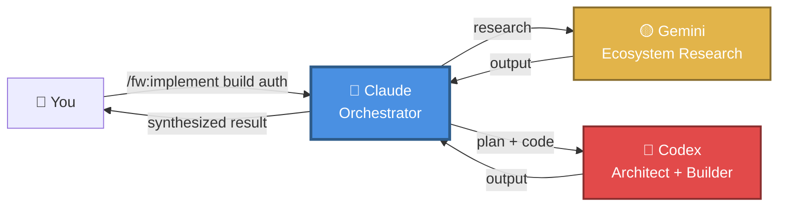
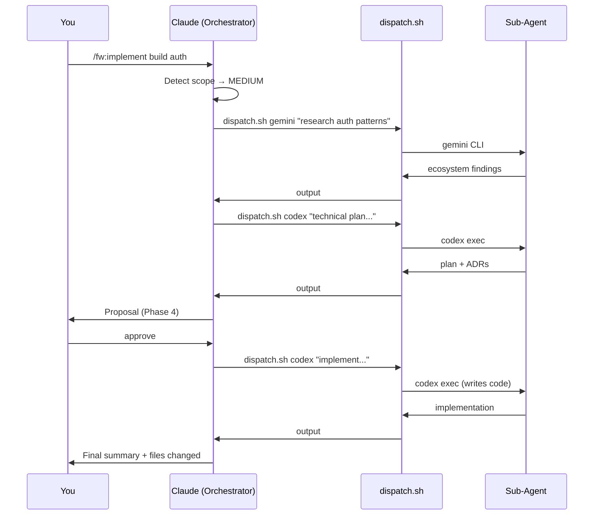

# Flywheel Plugin for Claude Code

> **Multi-provider AI orchestration plugin** — Let Claude orchestrate specialized agents (Codex, Gemini) across structured workflows

[](https://github.com/yourusername/flywheel-plugin)
[](LICENSE)

---

## What is Flywheel?

Flywheel transforms Claude into an **orchestrator** that spawns specialized AI agents for different tasks. Instead of Claude doing everything alone, it delegates specific work to expert agents and synthesizes their outputs.

**Think of it as:** Claude is the project manager, sub-agents are the specialists.



---

## ✨ Features

- 🎯 **Multi-Provider Support** — Codex, Claude sub-agents, Gemini
- 🏗️ **Full Feature Workflows** — Research → Plan → Propose → Build → Test in one command
- 🧠 **Smart Auto-Routing** — Claude picks the best agent for each phase
- 💾 **Session Persistence** — All phase outputs saved, sessions resumable
- ⚡ **Scope Detection** — Auto-adjusts workflow depth for small vs large features
- 🎨 **Visual Indicators** — See which provider is running (🔴/🔵/🟡)
- 🔒 **Sandbox Control** — Configurable safety levels for Codex
- 🛠️ **Extensible** — Define custom agents in YAML

---

## 🚀 Quick Start

### Installation

```bash
git clone https://github.com/yourusername/flywheel-plugin.git

# Install as a Claude Code plugin
cp -r flywheel-plugin ~/.claude-code/plugins/fw
```

### Setup

Inside Claude Code, run:
```
/fw:setup
```

This will detect available providers (Codex, Claude, Gemini) and create `~/.flywheel/`.

---

## 📚 Commands

### `/fw:setup`
Detect and configure AI providers.

```
🔍 Flywheel Provider Detection
─────────────────────────────────
  🔴 Codex CLI:  ✓ Available (auth: oauth, model: gpt-5.3-codex)
  🔵 Claude CLI: ✓ Available (v2.1.44)
  🟡 Gemini CLI: ✓ Available (auth: possible-oauth)
─────────────────────────────────
  3 providers ready
```

---

### `/fw:implement <feature description>`

**Full 9-phase feature workflow.** The most powerful command — handles everything from research to tested code.

```
/fw:implement build a user authentication system with JWT
/fw:implement add a logout button to the nav
/fw:implement architect a multi-tenant permission system
```

**Phases:**

| # | Phase | Agent | What happens |
|---|-------|-------|-------------|
| 0 | Scope detection | Claude | Detects `small` / `medium` / `large` |
| 1 | Research | Claude + Gemini | Codebase scan + ecosystem research |
| 2 | Planning | Codex | Technical plan, ADRs, file map |
| 3 | Questions | Claude | Gap analysis → max 5 critical questions |
| 4 | Proposal | Claude | Structured spec + acceptance criteria |
| 5 | **User Gate** | **You** | ⛔ Approve / modify / cancel |
| 6 | Iteration | Codex → Claude | Approach review loop (medium/large) |
| 7 | Implementation | Codex | Writes the code |
| 8 | Testing | Codex + Claude | TDD-style tests + coverage review |
| 9 | Return | Claude | Summary, files changed, next steps |

All phase outputs saved to `~/.flywheel/implement/<session>/`.

**Scope behaviour:**
- `small` (fix/add/tweak) — skips Gemini research + iteration loop for speed
- `medium` (implement/build) — full workflow
- `large` (architect/system) — full workflow + deeper research

---

### `/fw:delegate [using <provider>] <task>`

Delegate a single task to a sub-agent. Best for one-shot tasks.

```
/fw:delegate using codex refactor this function
/fw:delegate research OAuth alternatives
/fw:delegate explain how JWT works
```

**Auto-detection:**
| Task keywords | Provider | Why |
|--------------|----------|-----|
| implement, build, refactor | 🔴 Codex | Code generation strength |
| review, analyze, explain | 🔵 Claude | Reasoning and analysis |
| research, compare, explore | 🟡 Gemini | Broad knowledge |

---

### `/fw:review`

Multi-agent PR code review with configurable depth (`low` / `medium` / `critical`) and output options (`local` / `draft` / `direct` to GitHub).

---

## 🛠️ Configuration

### Agent Configuration

Edit `~/.flywheel/agents.yaml`:

```yaml
agents:
  - name: "codex"
    provider: "codex"
    model: "gpt-5.3-codex"
    sandbox: "workspace-write"  # or "read-only", "danger-full-access"
```

### Environment Variables

| Variable | Default | Purpose |
|----------|---------|---------|
| `FLYWHEEL_MAX_TIMEOUT` | `1800` | Max agent execution time in seconds (30 min) |
| `FLYWHEEL_CODEX_SANDBOX` | `workspace-write` | Default sandbox mode for Codex |
| `FLYWHEEL_SHOW_THINKING` | `true` | Show Codex reasoning for o-series models |
| `FLYWHEEL_IMPLEMENT_DIR` | `~/.flywheel/implement` | Where implement session files are saved |

> **Legacy**: `FLYWHEEL_TIMEOUT` still works as a fallback for `FLYWHEEL_MAX_TIMEOUT`.

---

## 📖 Provider Setup

### Codex (Recommended for Code)

```bash
npm install -g @openai/codex
codex login
# or: export OPENAI_API_KEY="sk-..."
```

### Claude (Built-in)
Comes with Claude Code — nothing to install.

### Gemini (For Research)

```bash
npm install -g @google/gemini-cli
export GEMINI_API_KEY="..."
```

---

## 🏗️ Architecture

See [**docs/ARCHITECTURE.md**](./docs/ARCHITECTURE.md) for the full architecture guide.



---

## 📁 File Structure

```
flywheel-plugin/
├── commands/
│   ├── implement.md     # Full feature workflow (9 phases)
│   ├── delegate.md      # Single-task delegation
│   ├── review.md        # PR code review
│   └── setup.md         # Provider setup
├── scripts/
│   ├── dispatch.sh      # Multi-provider executor
│   ├── detect-providers.sh
│   └── check_codex.sh
├── config/
│   └── agents.yaml
└── docs/
    ├── ARCHITECTURE.md
    ├── DELEGATION_FLOW.md
    └── GETTING_STARTED.md
```

**Session storage:**
```
~/.flywheel/
├── results/             # dispatch.sh outputs (delegate/review)
│   ├── latest-codex.md
│   └── 20260218-*.md
└── implement/           # /fw:implement sessions
    └── 20260218-213528/
        ├── 00-session.md
        ├── 01-research-*.md
        ├── 04-proposal.md
        └── 09-return.md
```

---

## 🔄 Roadmap

### ✅ Phase 1 (Complete)
- Multi-provider dispatch (Codex, Claude, Gemini)
- Smart provider detection with caching
- Output capture and storage
- Auto-routing by task type

### ✅ Phase 2 (Complete)
- `/fw:implement` — full 9-phase feature workflow
- `/fw:review` — multi-agent PR review
- Session persistence and resumability
- Scope-aware workflow depth

### 🔮 Phase 3 (Planned)
- `/fw:debug` — specialized debugging agents
- Composable custom workflows in markdown
- Result synthesis across multiple agents

---

## 🤝 Contributing

Contributions welcome! Please read our [contributing guidelines](CONTRIBUTING.md) first.

---

## 📄 License

MIT License - see [LICENSE](LICENSE) file for details.

---

## 🙏 Acknowledgments

Inspired by [claude-octopus](https://github.com/nyldn/claude-octopus) multi-provider orchestration patterns.
