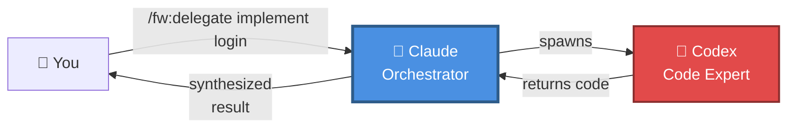
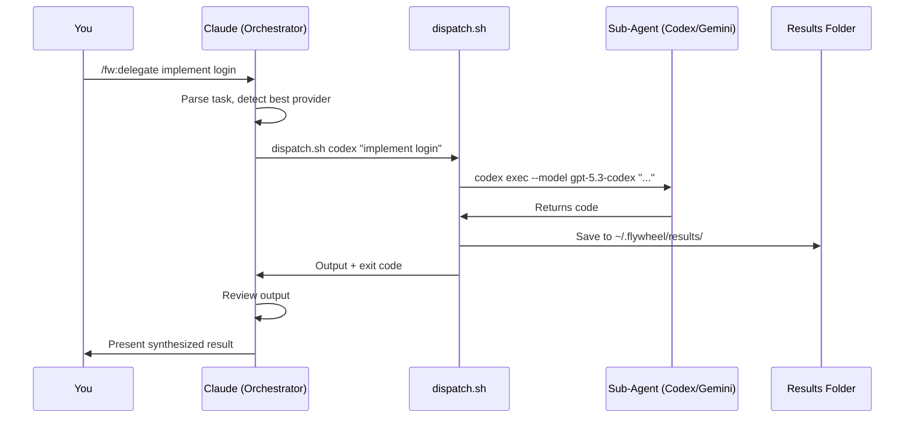

# Flywheel Plugin for Claude Code

> **Multi-provider AI delegation plugin** — Let Claude orchestrate specialized agents (Codex, Gemini) for better results

[](https://github.com/yourusername/flywheel-plugin)
[](LICENSE)

---

## What is Flywheel?

Flywheel transforms Claude into an **orchestrator** that can spawn specialized AI agents for different tasks. Instead of Claude doing everything alone, it delegates specific work to expert agents and synthesizes their outputs.

**Think of it as:** Claude is the project manager, sub-agents are the specialists.



---

## ✨ Features

- 🎯 **Multi-Provider Support** — Codex, Claude sub-agents, Gemini
- 🧠 **Smart Auto-Routing** — Claude picks the best agent for each task
- 💾 **Result Capture** — All outputs saved to `~/.flywheel/results/`
- ⚡ **Fast Provider Detection** — Cached checks, 1hr TTL
- 🎨 **Visual Indicators** — See which provider is running (🔴/🔵/🟡)
- 🔒 **Sandbox Control** — Configurable safety levels for Codex
- 🛠️ **Extensible** — Define custom agents in YAML

---

## 🚀 Quick Start

### Installation

```bash
# Clone the repository
git clone https://github.com/yourusername/flywheel-plugin.git

# Install as a Claude Code plugin
cp -r flywheel-plugin ~/.claude-code/plugins/fw
```

### Setup

Inside Claude Code, run:
```
/fw:setup
```

This will:
- Detect available providers (Codex, Claude, Gemini)
- Create configuration directory (`~/.flywheel/`)
- Copy default agent configs

### Your First Delegation

```
/fw:delegate using codex implement a React login form
```

Claude will:
1. Spawn a Codex agent
2. Codex generates the code
3. Claude reviews and presents the result

---

## 📚 Commands

### `/fw:setup`
Detect and configure AI providers.

**Example output:**
```
🔍 Flywheel Provider Detection
─────────────────────────────────
  🔴 Codex CLI:  ✓ Available (auth: oauth, model: gpt-5.3-codex)
  🔵 Claude CLI: ✓ Available (v2.1.44)
  🟡 Gemini CLI: ✓ Available (auth: possible-oauth)
─────────────────────────────────
  3 providers ready
```

### `/fw:delegate [using <provider>] <task>`
Delegate any task to a sub-agent.

**Auto-detection examples:**
- `/fw:delegate implement a user authentication system` → 🔴 Codex (code generation)
- `/fw:delegate explain how JWT works` → 🔵 Claude (analysis)
- `/fw:delegate research OAuth alternatives` → 🟡 Gemini (research)

**Explicit provider:**
- `/fw:delegate using codex refactor this function`
- `/fw:delegate using gemini compare React vs Vue`

### `/fw:review`
Multi-agent code review with comparison and synthesis.

**Coming in Phase 2** — will spawn multiple agents to review code from different perspectives.

---

## 🎯 Use Cases

### 1. Code Implementation
**You**: `/fw:delegate using codex build a pagination component`

**What happens:**
- Codex generates the component
- Claude reviews the code quality
- Presents the final result with suggestions

### 2. Analysis & Planning
**You**: `/fw:delegate analyze the security of this authentication flow`

**What happens:**
- Claude auto-selects Claude sub-agent (best for analysis)
- Sub-agent performs deep analysis
- Claude synthesizes findings

### 3. Research
**You**: `/fw:delegate research GraphQL vs REST for our API`

**What happens:**
- Claude auto-selects Gemini (best for research)
- Gemini explores the topic
- Claude summarizes pros/cons

### 4. Multi-Perspective Review (Phase 2)
**You**: `/fw:review review my staged changes`

**What happens:**
- Spawns Codex for code quality review
- Spawns Claude sub-agent for architecture review
- Compares both outputs
- Presents unified summary

---

## 🛠️ Configuration

### Agent Configuration

Edit `~/.flywheel/agents.yaml` to customize agents:

```yaml
agents:
  - name: "codex"
    provider: "codex"
    model: "gpt-5.3-codex"
    sandbox: "workspace-write"  # or "read-only", "danger-full-access"
    capabilities:
      - "code-generation"
      - "refactoring"
      
  - name: "claude-sub"
    provider: "claude"
    model: "sonnet"  # or "opus", "haiku"
    capabilities:
      - "analysis"
      - "review"
```

### Environment Variables

- `FLYWHEEL_TIMEOUT` — Max agent execution time (default: 300s)
- `FLYWHEEL_CODEX_SANDBOX` — Default sandbox mode for Codex
- `FLYWHEEL_SHOW_THINKING` — Show Codex thinking process for o-series models (default: false)

---

## 📖 Provider Setup

### Codex (Recommended for Code)

```bash
# Install
npm install -g @openai/codex

# Authenticate
codex login

# Or use API key
export OPENAI_API_KEY="sk-..."
```

### Claude (Built-in)

Claude CLI comes with Claude Code — nothing to install!

### Gemini (For Research)

```bash
# Install
npm install -g @google/gemini-cli

# Set API key
export GEMINI_API_KEY="..."
```

---

## 🏗️ Architecture

For detailed architecture documentation, see:
- [**ARCHITECTURE.md**](./docs/ARCHITECTURE.md) — How everything works
- [**GETTING_STARTED.md**](./docs/GETTING_STARTED.md) — Step-by-step guide

**High-level flow:**



---

## 📁 File Structure

```
flywheel-plugin/
├── commands/
│   ├── delegate.md      # Delegation command logic
│   ├── review.md        # Code review command
│   └── setup.md         # Provider setup
├── scripts/
│   ├── dispatch.sh      # Multi-provider executor
│   ├── detect-providers.sh  # Provider detection
│   └── check_codex.sh   # Legacy Codex check
├── config/
│   └── agents.yaml      # Agent definitions
└── docs/
    ├── ARCHITECTURE.md  # Detailed architecture
    └── GETTING_STARTED.md  # Setup guide
```

---

## 🔄 Roadmap

### ✅ Phase 1 (Complete)
- Multi-provider dispatch (Codex, Claude, Gemini)
- Smart provider detection with caching
- Output capture and storage
- Auto-routing by task type

### 🚧 Phase 2 (In Progress)
- Multi-agent code review
- Enhanced `/fw:implement` with validation
- `/fw:debug` with specialized debugging agents

### 🔮 Phase 3 (Planned)
- Composable workflows (define multi-step delegations in markdown)
- Result synthesis across multiple agents
- Custom workflow templates

---

## 🤝 Contributing

Contributions welcome! Please read our [contributing guidelines](CONTRIBUTING.md) first.

---

## 📄 License

MIT License - see [LICENSE](LICENSE) file for details.

---

## 🙏 Acknowledgments

Inspired by [claude-octopus](https://github.com/nyldn/claude-octopus) multi-provider orchestration patterns.

---

## 📞 Support

- **Issues**: [GitHub Issues](https://github.com/yourusername/flywheel-plugin/issues)
- **Discussions**: [GitHub Discussions](https://github.com/yourusername/flywheel-plugin/discussions)
- **Documentation**: [docs/](./docs/)
