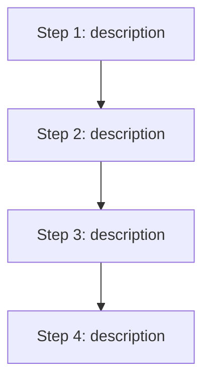
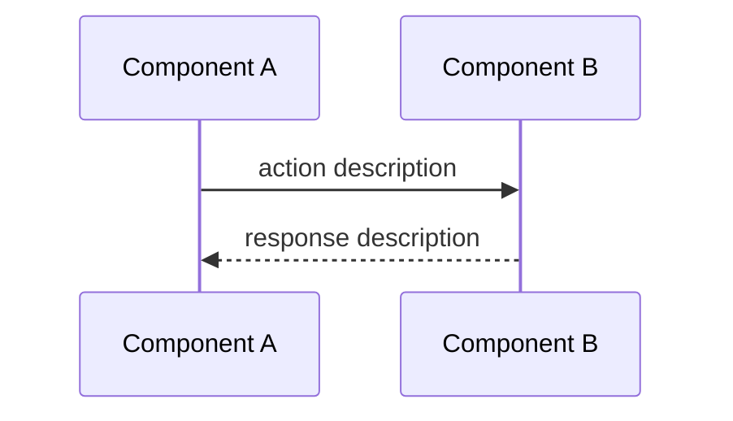
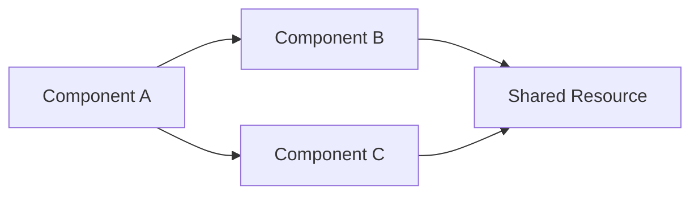
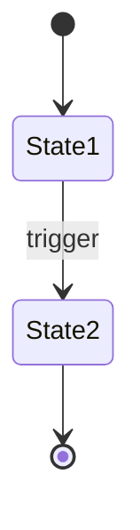
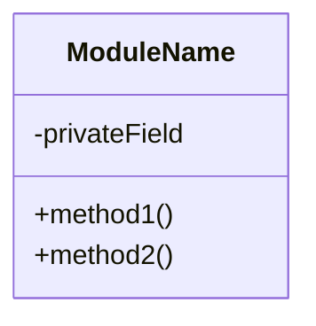

# Document Workflow

> **Persona active:** `fw-researcher` — deep ecosystem researcher. Invoked for broad or architectural topics to gather external best practices, library context, and real-world patterns.

This command runs a structured 5-phase research and writing workflow. It produces a polished markdown document explaining the requested topic with mermaid diagrams. **No code is ever modified — this command is strictly read-only.**

---

## Step 0: Parse Input & Classify Scope

Parse the user's input:
- **Topic**: the full text after `/fw:document`
- If no topic provided, ask: *"What would you like documented? Name a component, feature, workflow, concept, or area of the codebase."*

**Clarify intent** if the topic is ambiguous. Up to 2 focused follow-ups:

- "Are you asking about the internal implementation or the external-facing API?"
- "Should this cover just this project, or also how it integrates with external services?"

If the topic is already clear, skip follow-ups and proceed.

**Classify scope** from the topic:

| Scope | Trigger signals | Effect |
|-------|----------------|--------|
| `narrow` | single function, config option, one file, specific API endpoint | Skip Phase 2 (ecosystem research) — codebase alone is sufficient |
| `broad` | feature area, module, workflow, integration, multi-file system | All phases |
| `architectural` | system design, data flow, deployment, cross-service, full architecture | All phases + expanded research + additional diagram types |

Show the classification:
```
📝 Topic: <topic>
🔍 Scope: BROAD — running full documentation workflow
```

**Create session directory (per-project isolation):**
```bash
PROJECT_NAME="${FLYWHEEL_PROJECT:-$(basename "$(git rev-parse --show-toplevel 2>/dev/null || echo "$PWD")")}"
SESSION_DIR="$HOME/.flywheel/projects/$PROJECT_NAME/document/$(date +%Y%m%d-%H%M%S)"
mkdir -p "$SESSION_DIR"
```

Save `$SESSION_DIR/00-session.md` with:
- Topic (original + clarified)
- Scope level
- Start timestamp
- Git branch (run `git branch --show-current`)
- Working directory

---

## Phase 1: Codebase Deep Scan 🔍

> *Claude researches the codebase to build a complete factual picture*

**Goal:** Gather every relevant fact about the topic from the codebase. No speculation — only observed code.

You (Claude) perform:

1. **Keyword scan** — grep for terms, function names, class names, file names related to the topic
2. **Read key files** — view the most relevant files (aim for the minimum set that gives full understanding)
3. **Trace call chains** — follow execution paths through the topic area: entry points, core logic, exit points
4. **Map relationships** — identify which components interact, what depends on what, data flow direction
5. **Note patterns** — conventions, error handling, naming, configuration relevant to the topic
6. **Identify boundaries** — where does this topic's responsibility start and end? What's adjacent but separate?

Save findings to `$SESSION_DIR/01-research.md`.

Print:
```
✅ Phase 1 Complete — Codebase Research
   Files examined: <N> files across <M> directories
   Key components: <brief list>
   Call chain depth: <N> levels traced
```

---

## Phase 2: Ecosystem Cross-Reference 🌐

> *External research for broader context and best practices*
> **Skipped for `narrow` scope**

**Goal:** Add ecosystem context — how does this topic relate to wider patterns, standards, or known approaches?

**Primary path — invoke `fw-researcher` persona:**

Task the `fw-researcher` sub-agent:
```
Task(fw-researcher): Research the following topic in the context of the project's technology stack. Focus on patterns, conventions, and explanations that would help someone understand this codebase area. Do NOT suggest code changes.

TOPIC: <TOPIC>

Detected technologies: <TECHNOLOGIES_FROM_PHASE_1>

IMPORTANT: Use the context7-research skill — call Context7 MCP tools first for each detected
technology (max 3) to get official documentation before falling back to WebSearch.
Query template: "How <TOPIC> works in <library>. API reference, usage patterns, and configuration"

TECHNOLOGY STACK:
<detected from Phase 1 — language, framework, key libraries, versions>

CODEBASE CONTEXT:
<summary of key findings from Phase 1>

Research:
1. Official documentation (via Context7) — how this feature/pattern is documented officially
2. How is this pattern/feature typically implemented in the current stack? What are the conventions?
3. Are there official documentation pages or guides for this area?
4. Common misconceptions or gotchas to call out in documentation.
5. How does this project's approach compare to standard practice? (conventional, custom, or anti-pattern?)
6. Any relevant architectural patterns this topic falls under (e.g., middleware pattern, observer pattern, repository pattern).
```

**Fallback — if fw-researcher not available, run Gemini:**

Before dispatching to Gemini, enrich the prompt with Context7 documentation:
1. Identify technologies from the topic and Phase 1 findings (max 3)
2. For each, call `mcp__context7__resolve-library-id` then `mcp__context7__query-docs` with query: "How <TOPIC> works in <library>. API reference, usage patterns, and configuration"
3. If Context7 returns results, prepend them to the Gemini prompt as `OFFICIAL DOCUMENTATION CONTEXT`
4. If Context7 fails or returns nothing, skip silently and dispatch without enrichment

```bash
"${CLAUDE_PLUGIN_ROOT}/scripts/dispatch.sh" "gemini" "OFFICIAL DOCUMENTATION CONTEXT (via Context7):
<Context7 findings, or omit this section if none>

---

Research the following topic for documentation purposes. Provide context that helps explain how this works, not suggestions for changing it.

TOPIC: <TOPIC>

TECHNOLOGY STACK:
<detected from Phase 1>

Research:
1. Standard conventions and patterns for this type of feature in the given stack.
2. Official documentation references.
3. Common misconceptions or gotchas worth documenting.
4. How this approach compares to typical implementations.
5. Relevant architectural patterns.

Be concise. Only include findings directly useful for explaining this topic."
```

Save output to `$SESSION_DIR/02-ecosystem.md`.

Print:
```
✅ Phase 2 Complete — Ecosystem Research
   Key context: <top 2-3 relevant findings>
   Pattern identified: <e.g., "standard middleware pattern" or "custom implementation">
```

---

## Phase 3: Synthesize Document 📄

**Goal:** Produce the final documentation — a clear, self-contained markdown document with mermaid diagrams.

You (Claude) write the document using all gathered context. Save to `$SESSION_DIR/03-document.md`.

**Generate a URL-safe topic slug** for the filename (lowercase, hyphens, no special chars). Example: "how does the authorizer work?" becomes `authorizer`.

Also save to the project at one of these locations (check which exists, in order):
1. `docs/<topic-slug>.md` — if a `docs/` directory exists
2. `claudedocs/<topic-slug>.md` — otherwise (create `claudedocs/` if needed)

### Document Template

The generated document follows this structure:

```markdown
# <Topic Title>

> Generated by `/fw:document` on <DATE>
> Project: <PROJECT_NAME>

---

## Overview
<2-3 sentence general description — what this is and why it exists>

## In Simple Terms
<ELI5 explanation — simplified description for someone unfamiliar with the codebase. Use analogies if helpful.>

---

## Detailed Explanation

### How It Works
<Detailed walkthrough of the system/feature/component. Walk through the logic step by step, referencing actual code paths and file names.>

### Workflow


<Include additional mermaid diagrams as appropriate for the topic. Choose from:>

**For request/event flows — Sequence Diagram:**


**For component relationships — Graph:**


**For state transitions — State Diagram:**


**For class/module structure — Class Diagram:**


<Only include diagram types that genuinely clarify the topic. A simple function might only need a flowchart. A request handler might need a sequence diagram. An architecture overview might need all of them. Use judgment — fewer clear diagrams beat many unclear ones.>

---

## Key Files

| File | Purpose |
|------|---------|
| `path/to/file1` | What this file does in relation to the topic |
| `path/to/file2` | What this file does |

---

## Configuration

<If the topic involves configurable behaviour, document it here. Otherwise omit this section.>

| Setting | Default | Description |
|---------|---------|-------------|
| `SETTING_NAME` | `value` | What it controls |

---

## Edge Cases & Gotchas

<List non-obvious behaviours, common mistakes, or things that surprised you during research. Omit if none found.>

- **Gotcha**: <description of non-obvious behaviour>
- **Edge case**: <what happens in unusual conditions>

---

## Related Topics

- **<Related Area 1>** — brief description of how it connects
- **<Related Area 2>** — brief description of how it connects
```

Print:
```
✅ Phase 3 Complete — Document Written
   Title: <document title>
   Diagrams: <N> mermaid diagrams (<types>)
   Saved to: <project path>
```

---

## Phase 4: User Review Gate ⛔

Ask the user:
```
📄 Documentation complete. How would you like to proceed?

  [approve]  — document is good, keep it as-is
  [refine]   — tell me what to adjust (I'll update the document)
  [deeper]   — research a specific section in more depth
  [discard]  — remove the generated document
```

- **approve** → Print "Document saved to `<project path>`. Session archived at `$SESSION_DIR`." and stop
- **refine** → Ask what to change, update the document, show the changes, repeat Phase 4. Max 3 rounds.
- **deeper** → Ask which section to expand. Run a targeted Phase 1 (and Phase 2 if broad/architectural) for that section, then update the document. Repeat Phase 4.
- **discard** → Delete the project copy (keep session dir as archive). Print "Document removed. Session archived at `$SESSION_DIR`."

---

## Error Handling

- **Phase fails** (dispatch.sh exits non-zero): Show the error, offer to retry or skip the phase
- **fw-researcher not available**: Fall back to Gemini for Phase 2
- **Gemini not available**: Skip Phase 2, rely on Claude's knowledge + codebase analysis only. Note the gap.
- **User cancels at any phase**: Save session state and print the session directory path
- **Target document already exists**: Ask whether to overwrite, rename (append timestamp), or cancel
- **Topic too vague after follow-ups**: Proceed with best interpretation and flag assumptions in the document

---

## Environment Variables

| Variable | Default | Purpose |
|----------|---------|---------|
| `FLYWHEEL_MAX_TIMEOUT` | `1800` | Max seconds per agent call (30 min) |
| `FLYWHEEL_PROJECT` | `<git repo name>` | Override project name for session isolation |
| `FLYWHEEL_DOCUMENT_DIR` | `~/.flywheel/projects/<project>/document` | Where document session files are saved |
