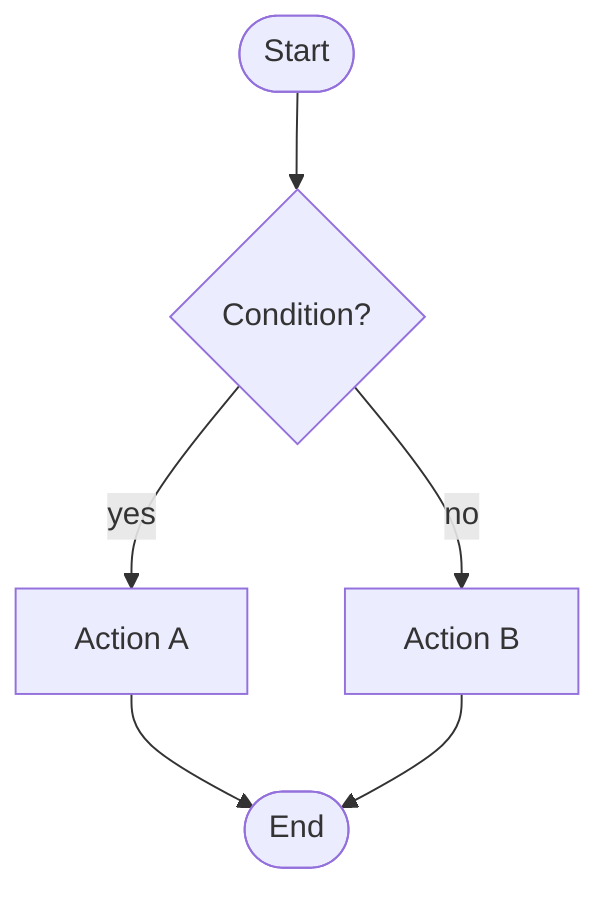
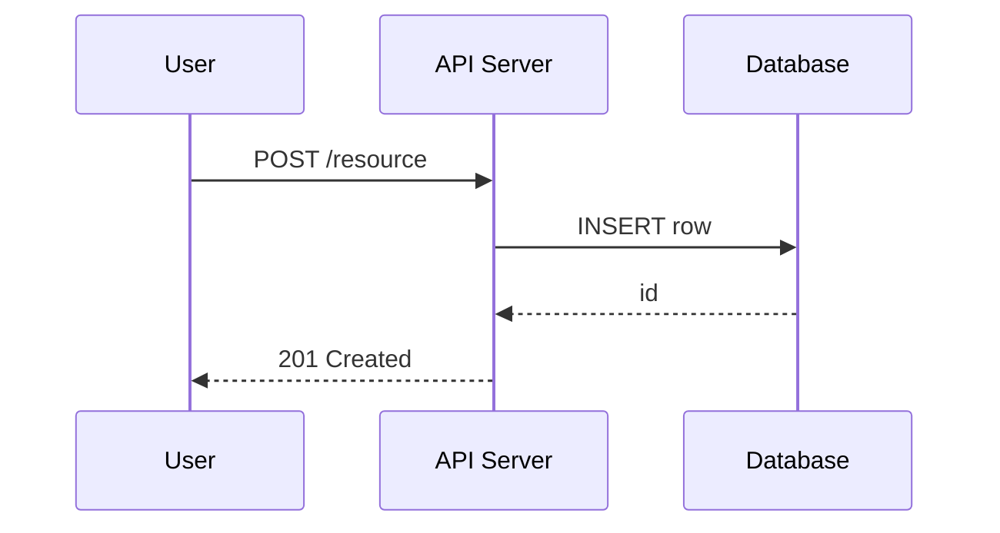
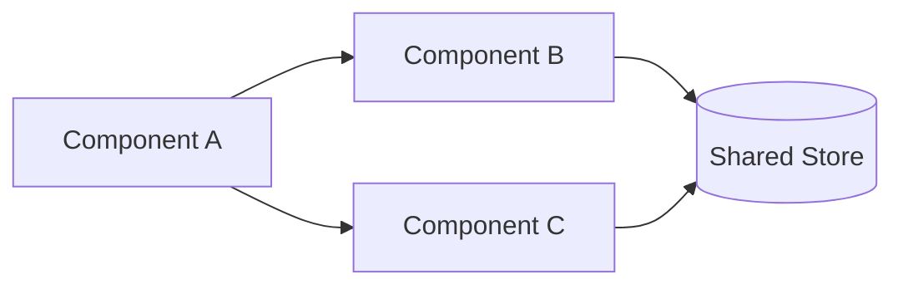
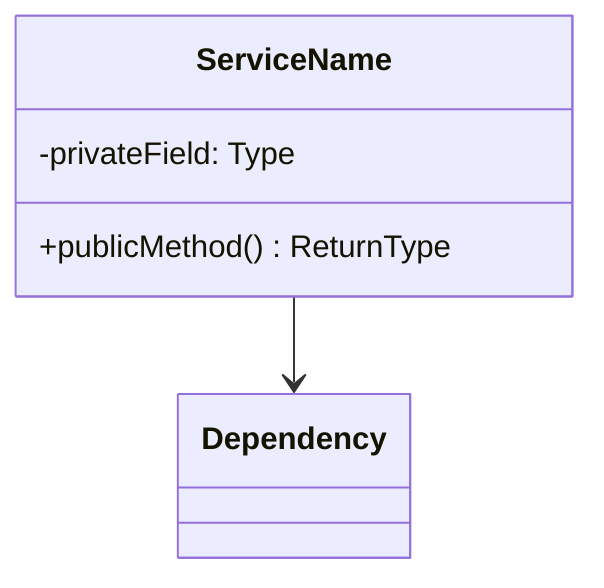
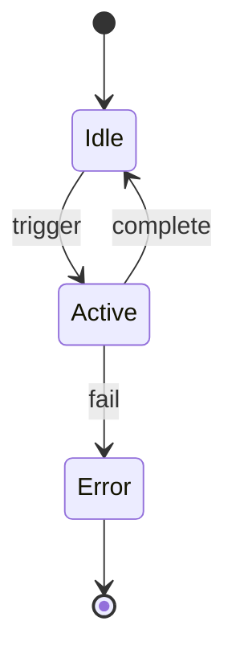
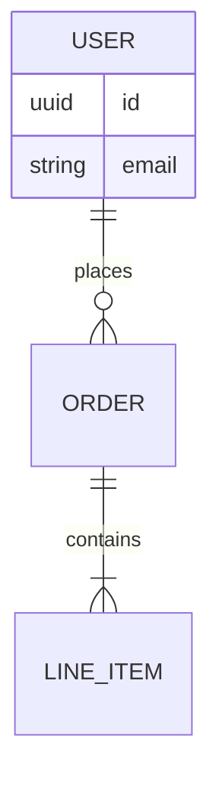
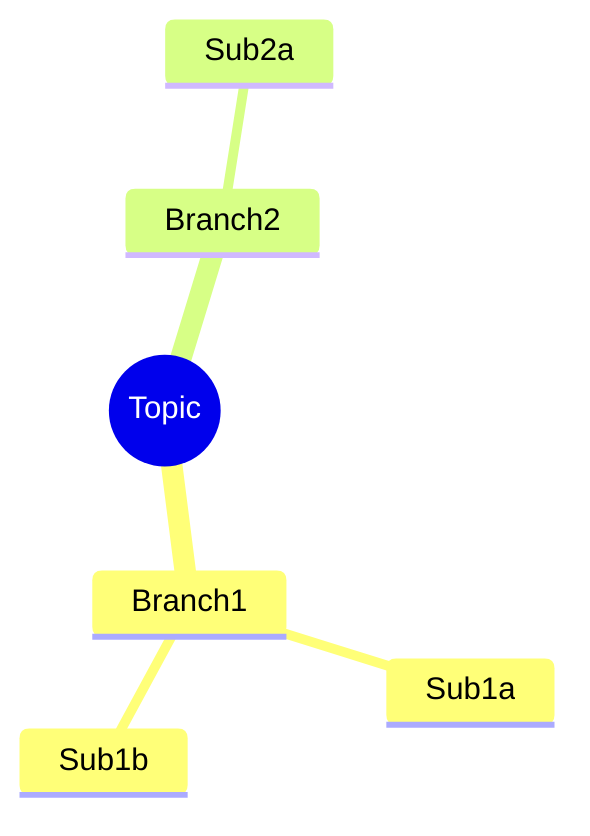
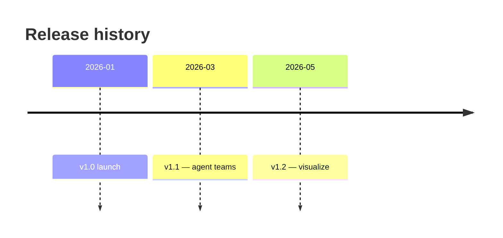
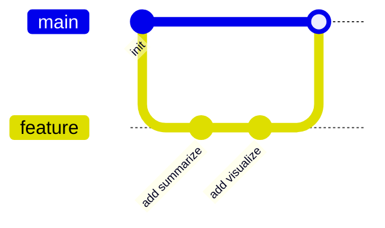

# Visualize Skill

## Purpose

Produce one or more mermaid diagrams that clarify the content under discussion — a code path, a proposed solution, a set of changes, a system architecture, or a concept hierarchy. The skill is content-driven: it picks the diagram type from observable signals in the source, and **refuses to draw a diagram if a sentence would do the same job**.

This skill does not modify code. It only emits mermaid blocks that the consuming command renders into its output.

---

## When to Activate

The consuming command activates this skill when **at least one** of the following is true:

| Signal | Why it warrants a diagram |
|--------|---------------------------|
| Multi-step process with branching | Flowchart clarifies decision points |
| Multiple actors exchanging messages | Sequence diagram exposes ordering |
| ≥3 components with non-trivial relationships | Graph reveals coupling |
| State transitions or lifecycle | State diagram shows valid transitions |
| Data model with ≥2 entities | ER diagram exposes cardinality |
| Time-ordered events / phases | Timeline or gantt anchors the order |
| Hierarchical concept breakdown | Mindmap shows decomposition |
| Architecture spanning ≥2 layers | C4 or graph reveals boundaries |

**Skip the skill entirely** when:
- The content is a single fact, a single change, or a flat list with no relationships
- A 2-3 sentence summary already conveys the structure
- The source is text-only with no structural content (e.g. a copywriting change)
- The user explicitly opted out

When skipped, no diagram block is emitted and no note is added.

---

## Diagram Type Selection

Pick the type from content signals — never default to flowchart out of habit.

| Content signal | Diagram type | Mermaid header |
|----------------|--------------|----------------|
| Process / control flow / decisions | Flowchart | ` ```mermaid\nflowchart TD\n` |
| Linear left-to-right pipeline | Flowchart LR | ` ```mermaid\nflowchart LR\n` |
| Request / response / event between actors | Sequence diagram | ` ```mermaid\nsequenceDiagram\n` |
| Component dependencies, module graph | Graph | ` ```mermaid\ngraph LR\n` |
| Class / module structure | Class diagram | ` ```mermaid\nclassDiagram\n` |
| Lifecycle, status transitions, state machine | State diagram | ` ```mermaid\nstateDiagram-v2\n` |
| Database schema, entity relationships | ER diagram | ` ```mermaid\nerDiagram\n` |
| Project plan, phase timeline with durations | Gantt | ` ```mermaid\ngantt\n` |
| Chronological events without durations | Timeline | ` ```mermaid\ntimeline\n` |
| Branch / commit / merge history | Git graph | ` ```mermaid\ngitGraph\n` |
| User journey with sentiment | Journey | ` ```mermaid\njourney\n` |
| System architecture across boundaries | C4 | ` ```mermaid\nC4Container\n` |
| Concept hierarchy, taxonomy, breakdown | Mindmap | ` ```mermaid\nmindmap\n` |
| 2×2 comparison or trade-off | Quadrant chart | ` ```mermaid\nquadrantChart\n` |
| Distribution / proportions | Pie | ` ```mermaid\npie\n` |

**Multiple diagrams are allowed** when the content has distinct facets (e.g. a request flow + a state machine). Cap at **3 diagrams per output** unless the consuming command explicitly raises the cap.

---

## Mermaid Syntax Rules

These rules prevent the most common rendering failures:

1. **Start every block with the language tag**: ` ```mermaid` (lowercase) and end with ` ``` ` on its own line.
2. **No raw parentheses, brackets, or quotes inside node labels** unless wrapped in double-quoted strings:
   - ❌ `A[Read file (line 42)]`
   - ✅ `A["Read file (line 42)"]`
3. **No HTML inside labels.** Use `<br/>` only — never `<br>`, `<p>`, or `<div>`.
4. **Arrow types**:
   - `-->` solid arrow
   - `-.->` dashed arrow (use for optional / fallback paths)
   - `==>` thick arrow (use for primary path)
   - `-->|label|` labeled arrow (no quotes around the label unless it has special chars)
5. **Node IDs** must be alphanumeric / underscores. The displayed label goes in `[]`, `()`, `{}`, or `[[]]` brackets.
6. **Sequence diagrams**: declare participants with `participant <Alias> as <Display Name>` to avoid spaces breaking layout.
7. **Class diagrams**: methods end with `()`; visibility uses `+` (public), `-` (private), `#` (protected).
8. **State diagrams**: use `stateDiagram-v2` (not `stateDiagram` — v2 is the only supported syntax for new diagrams).
9. **Subgraphs**: `subgraph Name ... end` — group related nodes for clarity in large flowcharts.
10. **Comments** inside mermaid: `%% comment text` — use sparingly, only when intent isn't clear from labels.

---

## Diagram Templates

### Flowchart (process / decision)



### Sequence Diagram (request / response)



### Graph (component relationships)



### Class Diagram (module structure)



### State Diagram (lifecycle)



### ER Diagram (data model)



### Mindmap (concept breakdown)



### Timeline (chronological events)



### Git Graph (branch / commit story)



---

## Output Format

When the skill produces output, the consuming command embeds it as follows:

```markdown
## Visualization

> <one-sentence description of what the diagram shows and why this type was chosen>

```mermaid
<diagram body>
```

<optional: 1-3 callouts naming non-obvious nodes/edges and what they represent>
```

If multiple diagrams are emitted, each gets its own `##` heading (`## Workflow`, `## Architecture`, `## Lifecycle`, etc.) — never a single block of stacked diagrams.

---

## Quality Checklist (run before emitting)

Before returning a diagram, verify:

- [ ] Every node ID is unique within the diagram
- [ ] Labels with spaces, parens, or punctuation are quoted
- [ ] No more than ~15 nodes per diagram (split into multiple if larger)
- [ ] Arrow direction matches actual data/control flow direction
- [ ] No orphan nodes (every node connects to at least one edge) unless it's an entry/exit
- [ ] Diagram type matches the dominant content signal — not just "flowchart by default"
- [ ] The accompanying sentence explains what the diagram is for, not what mermaid is

If any check fails, fix or downgrade to a simpler diagram. **A clear small diagram beats a sprawling accurate one.**

---

## Integration Pattern

```
Consuming command (summarize / document / design / debug / implement / reflect)
    │
    ├─ Detect signals (Step 0 / Phase 1)
    │
    ├─ [Visualize skill activates]
    │   ├─ Pick diagram type(s) from signals
    │   ├─ Emit mermaid block(s) with surrounding prose
    │   └─ Run quality checklist
    │
    └─ Render in command output (alongside summary / report / proposal)
```

The skill is **purely additive** — when activated, it appends visualization to the consuming command's existing output. It never replaces prose with diagrams.

---

## Error Handling

| Failure | Behaviour |
|---------|-----------|
| Content has no structural signal | Skip silently — emit no diagram |
| Mermaid syntax error after generation | Re-emit with simplest valid type (flowchart with 3 nodes) or skip |
| Diagram exceeds 15 nodes | Split into 2 diagrams or summarize a subset |
| User explicitly opts out (`no diagrams` / `text only`) | Skip without note |
| Unknown diagram type requested by user | Pick the closest supported type and proceed |

Failures are non-blocking. If the skill cannot produce a useful diagram, the consuming command's output is unaffected.

---

## Token Budget

- **Cap: 3 diagrams per output** unless the consuming command raises it (e.g. `/fw:visualize` itself may emit up to 5)
- **Cap: ~15 nodes per diagram** — split or simplify above this
- **Prose around diagrams: 1-3 sentences max** — the diagram should carry the weight, not the prose
- Skip the skill entirely if the prose summary already conveys the structure
